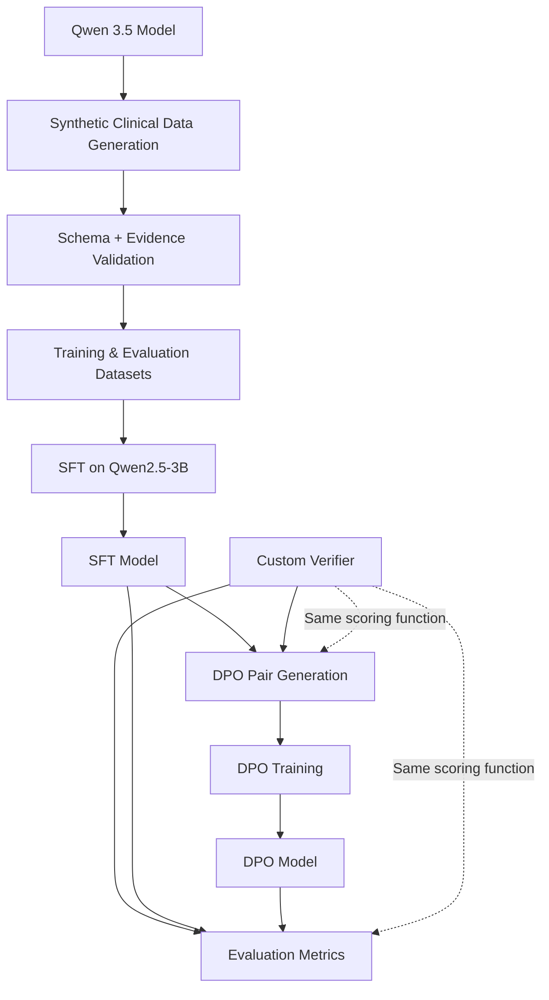
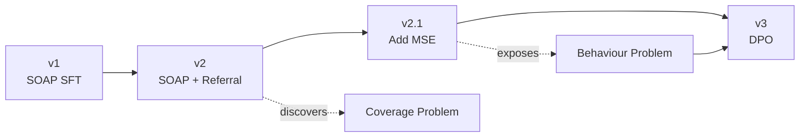
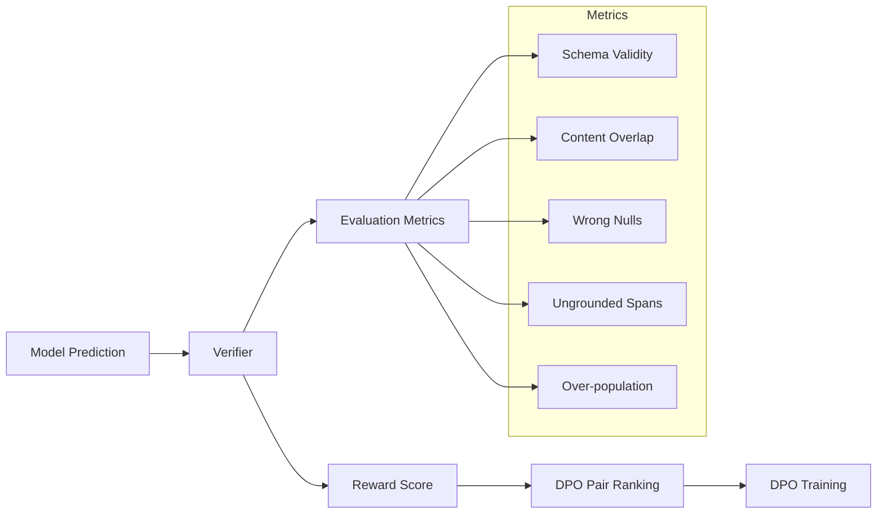

# Clinical Transcript Summariser

## Executive Summary

This project explores whether a small 3B (Qwen2.5-3B) parameter model can
extract structured clinical information from consultation transcripts across
multiple template formats.

The work progressed through:

1. SFT on synthetic clinical extraction datasets
2. Multi-template generalisation experiments
3. DPO preference alignment using a custom verifier
4. Analysis of where SFT fails and where preference optimisation helps

Key findings:

- SFT learns output structure well but struggles with unseen ontologies
- DPO improves grounded extraction behaviour on trained templates
- DPO does not create knowledge for unseen schemas
- Excessive DPO training causes output collapse
- A custom verifier can serve as both evaluation metric and alignment reward

Core technologies:

- Qwen2.5-3B Instruct (for SFT and DPO fine-tuning)
- Qwen3.5-latest (for data generation)
- Unsloth / LoRA
- DPO
- GGUF / llama.cpp
- Synthetic data generation
- Reward engineering

## 2. What this is and what it is not

This repository was put together to demonstrate clinical template-aware
extraction with a small model, and to explore the limits of supervised
fine-tuning (SFT) and the potential of preference-based alignment (DPO) to fix
the behavioural problems SFT cannot. The core contributions are:

1. Building a supervised fine-tuning (SFT) pipeline for a real, messy,
   multi-template extraction task, and flagging where it breaks.
2. Going past SFT into preference-based alignment (DPO now, GRPO as the planned
   next step), driven by a custom verifier that doubles as both the evaluation
   metric and the training reward.

It is **not** a production system. Most of the real work lives in notebooks,
because the GPU training runs on Kaggle and the inference experiments run
locally on a Apple M2 Pro.

## The task in plain terms

A clinician talks to a patient. We have a text transcript of that conversation.
Different clinicians use different templates to summarise the conversation. For
this PoC, we focus on three templates:

- A **SOAP** note (Subjective, Objective, Assessment, Plan), the standard GP
  format.
- A **referral** letter to a specialist.
- A **Mental State Examination** (MSE), a psychiatric format with fields like
  mood, affect, speech, thought, insight.

Each of these is a different JSON schema. The model is told at inference time
which schema to fill in, and it has to extract the right content into the right
fields. In addition, it must carry an `evidence_span`, which is a piece of text
from the transcript that justifies the value. This grounding requirement is what
makes the extraction reliable. **If the model writes down a diagnosis, we want
to point at the exact words in the conversation that support it.**

The hard instruction baked into the prompt is: use `null` for any field the
transcript does not mention. That keeps the model from hallucinating. We will
see later, it is a double-edged sword, because `null` is also a very safe place
to hide when the model is unsure.

## Architectural overview



### Where the work runs: two machines, two jobs

This is the single most important thing to understand about the layout. The
project is split across two very different environments, and the split is
deliberate.

```
  TRAINING (Kaggle)                          INFERENCE / EVAL (local laptop)
  =================                          ===============================
  - Free T4 GPU                              - Apple M2 Pro, no CUDA
  - Base: Qwen2.5-3B-Instruct                - llama.cpp with Metal acceleration
  - Unsloth + PEFT (LoRA)                    - GGUF q4_k_m quantised models
  - Heavy: SFT and DPO fit weights           - Loads the merged + quantised model
  - Outputs a fine-tuned adapter             - Runs the verifier over eval sets
        |                                            ^
        |  merge LoRA, convert to GGUF,              |
        |  quantise to q4_k_m                        |
        +--------------------------------------------+
                     model file moves down
```

Training needs a GPU, and a free Kaggle T4 is enough for the Qwen 2.5 3B base
with Unsloth and LoRA.

Inference and evaluation run on an Apple M2 Pro laptop without a GPU. So the
trained model is merged, converted to GGUF, and quantised to `q4_k_m`, then run
through `llama.cpp`, which uses the Mac's Metal backend. This is the same
serving stack we would use in production for a latency-bound endpoint with GPU
support. The model files for each stage live under `models/`. Not uploaded due
to size issue to github. The practical consequence for a reader: the notebooks
that train are Kaggle notebooks, and the notebooks that evaluate and demo
`demo_*.ipynb` can be run locally.

### How a single prediction is produced ?

At inference time, the path is short and lives mostly in `src/prompts.py`:

```
template_name + transcript
        |
        v
build_inference_messages(template_name, transcript)   # src/prompts.py
        |
        |-- looks up REGISTRY[template_name]["spec"]   # the JSON schema text
        |-- wraps it with the global SYSTEM_PROMPT
        |-- appends the transcript
        v
chat messages  ->  llama.cpp (GGUF model)  ->  raw text
        |
        v
score_prediction(template, raw, gold, transcript)     # src/verifier.py
        |
        v
metrics dict  (schema_valid, content_overlap, wrong_null, ungrounded, ...)
```

The system prompt tells the model it is a clinical scribe, that every leaf field
needs a verbatim `evidence_span`, that unmentioned fields are `null`, and that
the output is JSON only with no prose. The schema for the requested template is
injected into the prompt as text, so the same model can be asked for SOAP,
referral, or MSE just by swapping which spec it sees. This is what
"template-aware" means here. There is one model, and the template is data, not a
separate trained head.

## Data Generation: synthetic, validated, and stratified

There is no real patient data, for obvious reasons. The training and eval sets
are synthetic, generated by a larger local model (`qwen3.5:latest` via Ollama,
the teacher model from the section above) and then strictly validated before
being kept. The generation code lives under `src/data_generation/`.

How one example is made (`src/data_generation/generate.py`):

1. Pick a template and a stratification spec (length, number of issues,
   conversational style, filler density). Stratification is what stops every
   transcript from looking the same.
2. Build a generation prompt that includes the template's system prompt, the
   JSON schema, and one worked one-shot example that demonstrates the
   verbatim-evidence discipline.
3. Call the generator with `format="json"` and `think=False`. The `think=False`
   matters, because Qwen 3.x will otherwise spend its whole token budget on a
   hidden reasoning chain and emit nothing.
4. Run the output through `parse_and_validate`
   (`src/data_generation/validate.py`). This is the strict gate. It checks the
   JSON parses, the schema nesting is correct, and crucially that every
   `evidence_span` is an exact substring of the transcript. Anything that fails
   is discarded and retried with a small temperature bump.

So every example that survives is schema-valid and fully grounded by
construction. That is what makes it usable later as gold for both SFT targets
and verifier scoring.

The templates and their pieces live in `src/data_generation/templates/`:

- `soap.py`, `referral.py`, `mse.py` each hold a schema spec, a generation
  system prompt, and a one-shot example.
- `__init__.py` is the `REGISTRY`. Note that `referral_a` and `referral_b` share
  the same schema but use different one-shot examples, so they differ only in
  transcript style, not in output ontology. That detail becomes important in the
  results.

The datasets themselves live under `data/qwen3.5_latest/` (gitignored). The
split is roughly 50 train examples per trained template, 10 in-distribution eval
examples per template, and held-out zero-shot eval sets for `referral_b` and
`mse`, plus the generated `dpo_pairs.jsonl` used for preference training.

## Experimental Journey: v1 --> v2 --> v2.1 --> v3

The project is a sequence of experiments, each one designed to answer the
question the previous one raised. Here is the whole arc.



### Quick definitions.

#### SFT (Supervised Fine-Tuning), teaches the shape of the answer.

- What it solves: getting the model to produce outputs that look like your gold
  examples. Format, vocabulary, schema structure, domain phrasing.
- How: show input → gold output pairs. Loss = "how different was the model's
  next-token prediction from the gold token?" Updates weights to close that gap.

#### DPO (Direct Preference Optimisation), teaches which output is better when two are plausible.

- What it solves: behavioural preferences between similar-looking outputs.
  "Populate when grounded, abstain when not." "Don't hallucinate when
  uncertain." "Prefer concise over verbose."
- How: show input → (chosen, rejected) pairs. Loss pushes chosen up, rejected
  down, relative to a frozen reference copy of the model.

#### GRPO (Group Relative Policy Optimisation), teaches the model to maximise a numerical reward online.

- What it solves: same behavioural problems as DPO, but with a decomposable
  reward you can tune. e.g. trade off schema validity vs grounding vs coverage
  explicitly.
- How: at each step, sample N outputs for the same prompt, score each with a
  reward function, update weights to favour the higher-scoring ones within that
  group. No separate reward model needed if your reward is programmatic (ours
  is, it's the verifier)

### v1: SOAP-only SFT (the baseline)

Fine-tune only on SOAP. The result was that schema-valid output came easily
everywhere, because the schema is injected as text in the prompt and the model
just follows it. But content quality on templates it had never trained on was
weak. This established that "schema-valid" and "actually correct" are two
different things.

### v2: SOAP + referral_a SFT

Train on two templates. This improved the trained templates, and it transferred
for free to `referral_b`, because `referral_b` is the same schema as
`referral_a` with a different transcript style. That transfer looks impressive
but is mostly style transfer, not genuine generalisation.

The real test was `mse`, a genuinely unseen ontology with fields the model had
never been trained to fill. It collapsed. Schema validity dropped to 0.00 and 60
percent of outputs were entirely null. Faced with unfamiliar field names, the
model took the safe exit and emitted an empty, schema-shaped husk.

### v2.1-lite: add MSE to training

Adding MSE training data cured the MSE collapse (schema validity back to 1.00,
content overlap up to a usable level). But this is solving the problem by
training on it, not by generalising to it. The honest reading is that the
unseen-ontology ceiling is still there, just moved to whatever the next
untrained template would be.

More importantly, fixing the collapse exposed the residual problem that SFT
cannot fix at all.

### Two independent problems

By this point the failures had separated cleanly into two different kinds, and
this framing drives everything after it.

**Problem 1 is coverage.** When the model meets an output ontology it was never
trained on, it cannot map evidence into those fields. The only fix is data. No
preference method, no clever reward, helps here. `referral_b` stays capped
around 0.48 overlap because it is style transfer on a schema the model knows,
and true unseen ontologies need supervision.

**Problem 2 is behavioural.** On templates the model *was* trained on, inside
perfectly schema-valid JSON, it still makes two kinds of mistakes:

- It misses content that is present in the transcript and leaves the field null
  (a "miss").
- It writes a span that is not actually in the transcript (a "hallucination"),
  or fills a field the gold left empty.

SFT cannot fix Problem 2, and the reason is fundamental. SFT's loss is
token-level cross-entropy against a single gold target. It has no concept of
"schema valid", no concept of "this span exists in the transcript", and no way
to say "this output was better than that other plausible output". To fix Problem
2 you need a signal that ranks outputs by quality. That is exactly what
preference learning provides, and it is why the project moves to DPO.

### Verifier Design: the core and the bridge between evaluation and training

The single most important piece of code is `src/verifier.py`. It is used as both
the evaluation metric and the DPO reward. That dual use is key here. A generic
language-model evaluator does not know what a clinical evidence span is. This
one does, because it checks spans against the actual transcript.



`score_prediction(template, raw, gold, transcript)` returns a flat dict of
terms:

- `schema_valid`: did it parse as JSON and satisfy the schema's required nesting
  (0 or 1).
- `content_overlap`: Jaccard token overlap between the content the model
  produced and the gold content. A rough "did it say the right things" score.
- `wrong_null`: gold had a value here, the model left it null. These are the
  misses (Problem 2a).
- `correct_null`: gold was empty and the model correctly left it empty.
- `over_populated`: gold was empty and the model filled it anyway. A
  hallucination signal (Problem 2b).
- `grounded_spans` over `total_spans`: of the spans the model emitted, how many
  are exact substrings of the transcript. The other hallucination signal.
- `all_null`: did the whole output collapse to empty.

The same numbers, collapsed into a single scalar, become the DPO reward
(`reward(score)`):

```
if not schema_valid:
    reward = -1.0  # hard gate, invalid is always worst
else:
    reward = content_overlap
            - 0.5 * wrong_null_rate        # punish misses
            - 0.5 * ungrounded_span_rate   # punish hallucinated spans
            - 0.5 * over_populated_rate    # punish filling empty fields
```

Schema validity is a hard gate, because a structurally broken output is useless
no matter how good its content looks. Everything else is a graded trade-off
between covering the real content and not making things up. When generating
preference pairs, the candidate with the higher reward becomes `chosen` and the
lower becomes `rejected`. The verifier is the bridge between measuring the model
and improving it.

### v3: DPO (Direct Preference Optimisation)

DPO is the natural next step. Instead of one gold answer, you show the model
pairs of outputs, a `chosen` and a `rejected`, and the loss pushes the chosen
one up and the rejected one down relative to a frozen reference copy of the
model. The pairs are ranked by the verifier (see the next section). So the model
is being taught, directly, "populate when the evidence is there, do not invent,
prefer the grounded answer".

## Results Summary:

| Experiment               | Goal                            | Outcome            |
| ------------------------ | ------------------------------- | ------------------ |
| v1 SOAP SFT              | Learn SOAP extraction           | Successful         |
| v2 Multi-template SFT    | Transfer to referral schema     | Successful         |
| v2 Multi-template SFT    | Transfer to unseen MSE ontology | Failed             |
| v2.1 Add MSE supervision | Fix ontology collapse           | Successful         |
| v3 DPO 2 epochs          | Reduce misses/hallucinations    | Partial success    |
| v3 DPO 4 epochs          | More optimisation               | Overfit / degraded |

## DPO Error Analysis: the good, the bad, and the over-optimised

Two DPO runs were trained, identical except for how long they trained. The
comparison is the whole lesson, so both are described, but only the shorter run
is put forward as the result.

The two notebooks are:

- `notebooks/demo_v1_v2_v2.1_v3_problems_local_gguf_2_epochs_210pairs.ipynb`
  (the one submitted)
- `notebooks/demo_v1_v2_v2.1_v3_problems_local_gguf_4_epochs_213pairs.ipynb`
  (the comparison)

### The 4-epoch run: over-optimisation, a near-failure

Training longer broke the model. On SOAP, schema validity fell from 1.00 to
0.70, and the miss rate (wrong_null) jumped from 0.14 to 0.41. Three of ten SOAP
outputs broke down to unparseable, all-null junk, and it was the longest
transcripts that broke. The other templates were flat or slightly worse. The
stretch hypothesis that DPO might lift the untrained `referral_b` did not hold.

### The 2-epoch run: a mixed, partial success (the submitted result)

Halving the training length produced the intended effect on the template DPO was
designed to fix, while keeping the damage small:

- `referral_a` improved cleanly, which is exactly the Problem 2 effect we
  wanted. Misses (wrong_null) fell from 0.072 to 0.058, ungrounded spans fell
  from 0.046 to 0.031, and schema validity held at 1.00.
- SOAP regressed only slightly, through a single collapsed output (schema 1.00
  to 0.90). That one broken output was the richest transcript in the set, with
  the most gold fields to fill.
- MSE drifted a little worse (wrong_null 0.046 to 0.091, ungrounded 0.063 to
  0.119).
- `referral_b` was flat (overlap 0.482 to 0.482). The stretch hypothesis did not
  hold, which is consistent with Problem 1: DPO cannot create coverage the model
  never had.

So, DPO delivered the targeted improvement on the template it was aimed at, at
the cost of small regressions elsewhere for the toy dataset. Perhaps with more
resources and data, DPO can fix Problem 2.

### Why longer training was worse with DPO, and what it means

This is the textbook failure signature of offline DPO due to likelihood
displacement. The rejected examples are collapsed, null-heavy outputs. The
chosen examples are long, fully-populated outputs. These two sequences often
share their early tokens. When DPO pushes the rejected sequence's likelihood
down, it drags the shared early tokens down too, which also damages the long
chosen sequences. The longer you train, the more this compounds, until the
longest, richest outputs (the ones with the most shared early structure)
collapse. That is exactly the pattern observed: the failures concentrated on the
longest transcripts, and cutting the epochs from four to two cut the SOAP
collapses from three in ten down to one in ten and let the genuine `referral_a`
gain show through.

## Future Directions

This demo intentionally stops at one SFT pipeline and one DPO run. That was
enough to show the core idea, that a verifier which scores extractions can also
train the model. Several clear next steps remain. They are listed below,

### The direct fix: regularised DPO, then GRPO

The over-optimisation above is a property of *offline* DPO specifically, and
that points straight at what to do next.

**Cheap fix first: regularised on-policy DPO.** Anchor the chosen likelihood
with an `rpo_alpha` term (RPO-style) so DPO cannot drag the good sequences down.
Select the checkpoint on the verifier eval score, not on the training loss. Fix
length truncation so long transcripts are not silently cut. Generate the
preference pairs from the current policy, not from a stale snapshot.

**Principled successor: GRPO.** GRPO removes the offline problem entirely.
Instead of a fixed dataset of stale pairs, it samples fresh outputs from the
current policy for each prompt, scores each one with the same verifier reward,
and uses the group-relative advantage to update the policy. Since it is
on-policy there are no stale pairs and no likelihood displacement. The cost is
compute, since we have to generate samples inside the training loop. It is the
same magic used by DeepSeek-R1-Zero.

### Add more data, both more examples and more templates

There are two separate ways to add data, and they fix different things.

- **More examples of the templates we already train on.** Each trained template
  here has only about 50 examples. That is enough to learn the format but thin
  for the content. Adding more examples of `soap`, `referral_a`, and `mse` would
  most likely reduce the misses (fields the model should have filled but left
  blank) without any change to the method.
- **More templates.** Adding new formats such as a discharge summary or a
  progress note would test whether the approach really generalises, instead of
  just working on the three templates it has seen.

Both are cheap. They cost some data-generation and training time, not new
research.

### Reinforcement learning for tool calls

A real clinical scribe does not only write JSON. It also takes actions: saving a
note into the patient record, coding a diagnosis to a standard like *SNOMED* or
*ICD*, drafting a referral, ordering a lab test. Each of those is a tool call,
and tool calls are a natural fit for the same verifier-as-reward idea used here,
because you can check whether a tool call was correct.

The reward would break down into simple, checkable parts, and most of the
checking already exists in this repo:

- **Right tool:** did the model choose the correct action for the situation.
- **Valid arguments:** are the arguments well-formed for that tool. This is a
  hard pass-or-fail gate, the same as the `schema_valid` gate in the current
  verifier. A malformed call is useless no matter how good the intent.
- **Grounded arguments:** do the argument values actually come from the
  transcript word for word. This reuses the existing span-grounding check
  unchanged, so a referral reason or a coded symptom has to be backed by
  something the patient or clinician actually said.
- **Successful call :** did the call execute without error against the tool, or
  a stand-in for it. A clear, hard-to-fake signal.

With that reward, GRPO works the same way as described above, just scoring
actions instead of fields. The model proposes candidate tool calls, the verifier
scores each one, and training nudges the model toward calls that are
well-formed, grounded, and correct.

## A note on production serving

Although this repo does not serve anything, the inference stack chosen here is
the production stack for a latency-bound use case. The model is GGUF `q4_k_m`
run through `llama.cpp`, which in production would be served by `llama-server`
behind an OpenAI-compatible HTTP API, containerised, and run as Kubernetes
Deployments on GPU nodes with horizontal autoscaling on load. The `llama.cpp`
plus GGUF choice versus something like vLLM is a latency-bound versus
throughput-bound decision. `llama.cpp` with a quantised model gives low
single-request latency and a small footprint, which suits an interactive scribe.
vLLM with continuous batching wins when you are throughput-bound across many
concurrent requests.

## Repository map

```
src/
├── prompts.py
│   └── build_inference_messages (inference prompt)
├── verifier.py
│   └── verifier (eval metric + DPO reward, core contribution)
└── data_generation/
    ├── generate.py
    │   └── generate one validated synthetic sample
    ├── validate.py
    │   └── strict schema + verbatim-span validation gate
    ├── stratify.py
    │   └── stratification specs for variety
    └── templates/
        └── registry of templates
            ├── schema spec
            ├── generation prompt
            └── one-shot example per template

scripts/
└── helpers for data generation and local smoke testing

notebooks/
├── v1_soap_sft_baseline.ipynb
│   └── v1 SFT run, SOAP-only baseline
├── v2-multitemplate-sft-*.ipynb
│   └── v2 SFT run, SOAP + referral_a
├── v2.1-multitemplate-sft-*.ipynb
│   └── v2.1 SFT run, SOAP + referral_a + MSE
├── v3_dpo_pair_gen.ipynb
│   └── generate DPO preference pairs via the verifier
├── v3_dpo_train.ipynb
│   └── DPO training on the generated pairs
├── demo_v1_v2_v2.1_v3_problems_local_gguf_2_epochs_210pairs.ipynb
│   └── mixed/partial success
└── demo_v1_v2_v2.1_v3_problems_local_gguf_4_epochs_213pairs.ipynb
    └── over-optimisation failure

data/qwen3.5_latest/
├── synthetic datasets
└── dpo_pairs.jsonl (committed for demo purposes)

tests/
└── test_verifier.py
    └── 22 unit tests for the verifier

Root files/
├── Makefile
├── pyproject.toml
└── mise.toml
```

## Quickstart

Tooling is managed with `mise` (for pinned binaries like Python and `uv`) and
`uv` (for the Python environment).

Install `mise`:

```bash
brew install mise
```

Activate it in your shell, or add the eval line to your shell config:

```bash
mise activate zsh
```

Install the pinned tools and sync Python versions:

```bash
mise up
make sync-py-versions
```

Set up the local Python environment:

```bash
make setup-local-env
```

That target creates `.venv`, installs everything from `pyproject.toml`, and
installs the pre-commit hooks. Run anything inside the environment with:

```bash
uv run python <script>.py
```

Run the verifier tests to confirm the core scoring logic works:

```bash
uv run pytest tests/test_verifier.py
```

A few other useful targets: `make install`, `make add-group-deps`,
`make remove-group-deps`, `make run-pre-commit`.
